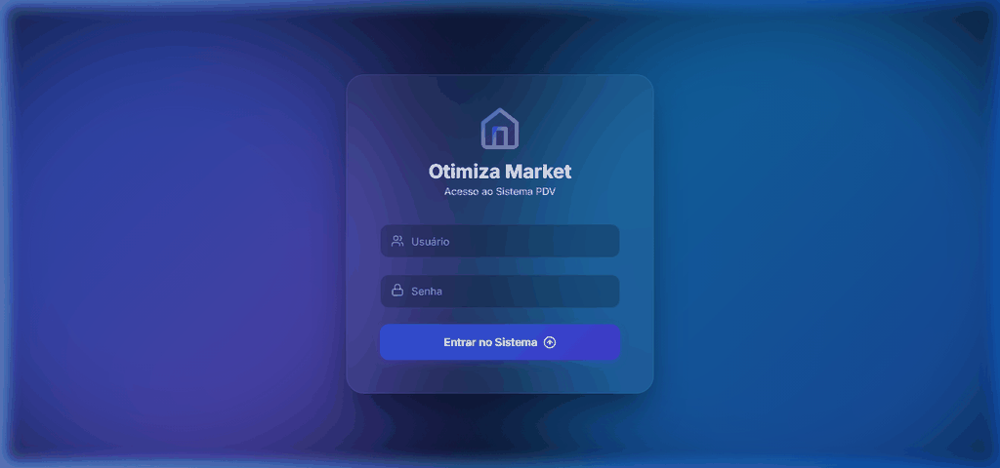

<div align="center">
  
  <h1>Otimiza Market PDV</h1>
  <p><strong>Um Sistema de Ponto de Venda (PDV) Moderno, Responsivo e Rápido.</strong></p>

  <div>
    
    
    
    
    
  </div>
</div>

---

## 📌 Sobre o Projeto

O **Otimiza Market** é uma aplicação completa de Frente de Caixa (PDV), projetada com foco absoluto em usabilidade, velocidade e responsividade. O sistema se adapta perfeitamente tanto a computadores desktop tradicionais quanto a tablets e dispositivos móveis.

Com uma interface moderna inspirada em tendências como o *Glassmorphism*, ele conta com botões intuitivos, menus retráteis e gráficos informativos na área de gestão.

## 🖼️ Prévia da Aplicação



## ✨ Principais Funcionalidades

- **🛒 Frente de Caixa Rápida:** Adição ágil de produtos por leitor de código de barras ou busca manual.
- **📱 100% Responsivo:** Design que se ajusta automaticamente a monitores grandes, tablets e smartphones (com barra de navegação inferior estilo app no celular).
- **📊 Resumo Financeiro:** Gráficos interativos (vendas e desempenho de fornecedores) para tomada rápida de decisões.
- **📦 Gestão de Produtos e Fornecedores:** Telas simples e diretas para organizar o seu estoque.
- **🎨 Design Moderno (Premium):** Efeitos de vidro (Glassmorphism), sombras dinâmicas, micro-animações, e identidade visual profissional.
- **🔍 Leitor de Código (Câmera):** Integração com câmera do dispositivo para ler QR Codes e códigos de barras.

## 🚀 Tecnologias Utilizadas

- **[React](https://reactjs.org/)** - Biblioteca base para a construção das interfaces.
- **[Vite](https://vitejs.dev/)** - Ferramenta de build rápida e moderna.
- **[Lucide React](https://lucide.dev/)** - Biblioteca de ícones leves e elegantes.
- **[Recharts](https://recharts.org/)** - Gráficos performáticos para o resumo financeiro.
- **[Html5-Qrcode](https://github.com/mebjas/html5-qrcode)** - Motor para leitura de códigos pela câmera.
- **[XLSX-JS-Style](https://git.sheetjs.com/)** - Exportação unificada e estilizada de planilhas Excel.

## ⚙️ Como rodar o projeto localmente

1. Clone o repositório:
   ```bash
   git clone https://github.com/bersou/otimiza-pdv-app.git
   ```
2. Acesse a pasta do projeto:
   ```bash
   cd otimiza-pdv-app
   ```
3. Instale as dependências:
   ```bash
   npm install
   ```
4. Inicie o servidor local:
   ```bash
   npm run dev
   ```

---

<div align="center">
  <h3>✨ Sobre o Desenvolvimento ✨</h3>
  <p>Este sistema foi concebido e arquitetado com foco extremo em UX/UI, performance e robustez.</p>
  <p>Cada detalhe foi pensado para facilitar o dia a dia do varejista, garantindo que a operação de venda e gestão seja rápida, fluida e muito agradável aos olhos, seja operando do computador ou do celular na palma da mão.</p>
  
  <p><strong>Desenvolvido com 💙 para inovação no varejo</strong></p>
  
  <p>
    <a href="https://github.com/bersou">Perfil no GitHub</a> • 
    <a href="https://otimiza-pdv.netlify.app/">Acessar Aplicação ao Vivo</a>
  </p>
</div>
